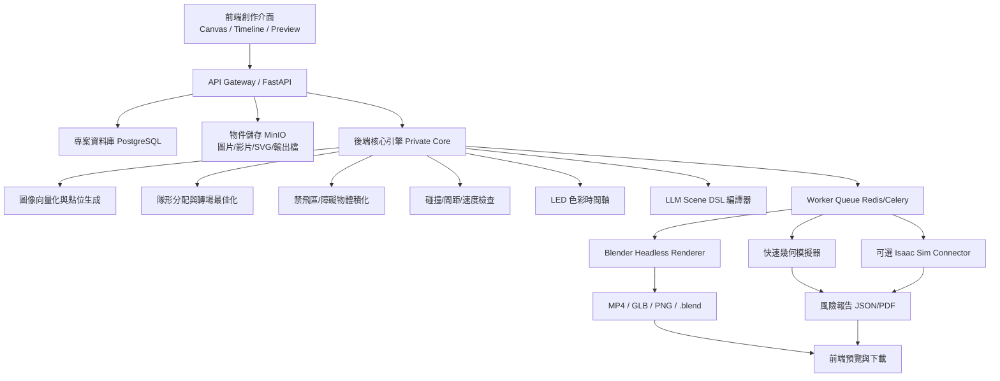
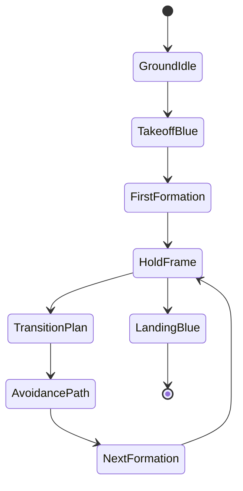

# drone-show-studio — Claude Code 完整實作規格書

> 專案定位：建立一套「無人機群飛展演動畫與可行性模擬平台」，以 Blender 產生 3D 動畫、以後端最佳化引擎計算隊形轉換與避障路徑、以 Isaac Sim 作為進階物理/感測器/數位分身驗證層。此專案第一階段只做動畫、規劃、模擬、風險檢查、報表與影片輸出，不輸出可直接驅動真實無人機的飛控命令、GPS 任務檔或實機控制參數。

---

## 0. 給 Claude Code 的總指令

你要在目前專案根目錄建立一個新專案目錄：

```bash
mkdir -p drone-show-studio
cd drone-show-studio
```

請使用 Python + FastAPI + Celery/RQ Worker + Redis + PostgreSQL + MinIO + Blender headless + 可選 Isaac Sim connector 的架構實作。前端只做創作、預覽、低解析度路徑查看與報表閱讀；所有核心演算法必須只在後端服務執行，不得把路徑最佳化、點位生成、IP 圖轉點位、避障、密度控制、隊形轉換、分配演算法、碰撞檢查規則庫、權重參數放在前端。

此專案的核心價值不是單純做出漂亮動畫，而是建立「可累積經驗的展演工程平台」：從 20 台、50 台、200 台開始，逐步擴展到更大規模，所有模擬、錯誤案例、風險報表、點位品質、動畫輸出、參數版本都必須保留，讓後續可持續改善。

---

## 1. 技術選型結論：Blender、CadQuery、Isaac Sim 要怎麼組合

### 1.1 Blender 的角色：主動畫與視覺輸出核心

Blender 是本專案的主角，負責：

1. 建立 3D 場景：天空、地面、攝影機、城市建築、高空氣球、禁飛區、舞台、觀眾視角。
2. 建立每台無人機的視覺代理物件：小球、LED 光點、機體簡模、軌跡線。
3. 使用 Bezier curve / polyline 產生「最少控制點」的飛行軌跡視覺化。
4. 依據後端產出的 `timeline_plan.json` 建立 keyframe animation。
5. 輸出 `.blend`、`.mp4`、`.png storyboard`、`.glb preview`。
6. 產生展演報告中的截圖：起飛圖、第一張定位圖、隊形轉換圖、避障路徑圖、碰撞風險圖。

Blender 只負責視覺呈現，不負責核心規劃邏輯。Claude Code 要把 Blender 腳本放在 `backend/render/blender_scripts/`，由 Worker 以 headless 模式執行：

```bash
blender -b -P backend/render/blender_scripts/render_show.py -- --plan outputs/job_x/timeline_plan.json
```

### 1.2 CadQuery 的角色：可選，不放主流程

CadQuery 不適合拿來做群飛軌跡動畫主流程。它適合做「參數化 CAD 幾何」，例如：

1. 用精確尺寸建立建築物、塔架、氣球吊掛框、舞台結構、地面起飛架、無人機展示模型。
2. 匯出 STEP/STL/3MF，再轉入 Blender 或 Isaac Sim。
3. 建立可重複使用的障礙物模板，例如：
   - 建築物盒狀體：寬、深、高、緩衝距離。
   - 大型氣球：球體半徑、吊繩、晃動安全半徑。
   - 禁飛柱體：圓柱半徑、高度。
   - 舞台與觀眾區：地面安全隔離區。

結論：

- 只做動畫與避障預覽：不用 CadQuery，Blender mesh primitive 就夠。
- 要做工程級場域數位分身、精準尺寸、可交付施工或展演審查圖：使用 CadQuery 產生參數化障礙物與場域模型。
- CadQuery 產物不可包含核心避障邏輯，只是 geometry asset generator。

請實作 `backend/cad/` 為可選模組，預設不啟用。

### 1.3 Isaac Sim 的角色：第二階段進階驗證

Isaac Sim 可以用來做：

1. 場域數位分身：載入建築物、氣球、塔架、地形、風場近似。
2. 多無人機物理模擬：檢查動畫路徑在物理世界是否過於急轉、過於密集、過度穿越障礙。
3. ROS 2 / Isaac ROS 橋接：未來若有授權展演廠商要做數位孿生驗證，可接入 robotics stack。
4. 感測器模擬：相機、LiDAR、碰撞接觸等。

但是 Isaac Sim 不應該取代第一階段的快速批次模擬，因為 200 台以上的頻繁預覽如果全部進 Isaac Sim，會很重。建議採雙層：

- 快速層：自建後端幾何/時間序列模擬，負責 20/50/200/500/1000 台的大量批次檢查。
- 高擬真層：Isaac Sim 只抽樣驗證高風險段落、重要轉場、特殊障礙場景。

---

## 2. 專案目標

### 2.1 第一階段目標

建立一套可以完成下列流程的平台：

1. 匯入一張圖片、LOGO、IP 圖、SVG、文字或短影片。
2. 將圖像轉成 2D/3D 點位隊形。
3. 根據無人機數量 20、50、200 自動降階或增細節。
4. 允許使用者在 CANVAS 上畫出禁飛區、障礙區、氣球區、建築區。
5. 後端將 CANVAS 區塊轉成 3D obstacle volume。
6. 自動規劃：
   - 地面起飛點。
   - 第一張圖定位點。
   - 每一張圖之間的隊形轉換。
   - 避障路徑。
   - 無人機間距檢查。
   - LED 色彩時間軸。
7. 在 Blender 製作動畫。
8. 產生可行性報告：
   - 最小間距。
   - 最大速度/加速度/轉向壓力的模擬指標。
   - 穿越障礙風險。
   - 路徑交錯風險。
   - 圖形細節保留率。
   - 點位不足提醒。
9. 讓 LLM 以「創作者語言」修改動畫，例如：
   - 「讓第一張圖先慢慢展開」。
   - 「把右上角圖案放大 20%」。
   - 「避開左側那顆氣球」。
   - 「讓起飛時全部是藍色，到定位後再轉成原圖顏色」。

### 2.2 不做的事情

第一階段不得做：

1. 不輸出實機飛控任務檔。
2. 不輸出 GPS waypoint 給實體無人機。
3. 不輸出可直接連接真實無人機的 MAVLink/Mission Planner/PX4/QGroundControl 任務。
4. 不提供實體無人機自動避障控制器。
5. 不提供實機集群控制演算法。
6. 不做武器、攔截、攻擊、干擾、追蹤目標或任何軍事用途功能。

本平台輸出限於：動畫、模擬資料、可視化報告、設計用 JSON、審查用 PDF/HTML、Blender/GLB/MP4。

---

## 3. 系統總架構



核心原則：

1. 前端只負責畫面和操作，不放核心演算法。
2. 後端 Private Core 才能看到完整點位、完整路徑、完整權重與風險規則。
3. 前端預覽資料必須降解析、抽樣、水印化、不可逆。
4. 重要資產、參數與演算法版本要簽章、記錄、不可任意下載。

---

## 4. 防抄襲與智慧財產保護設計

### 4.1 前端不得包含的內容

前端禁止出現：

1. 完整點位生成演算法。
2. 圖像向量化後的完整中間表示。
3. Min-cost assignment / matching / route optimization 的實作。
4. 障礙物 signed distance field / occupancy grid 生成細節。
5. 碰撞檢查規則庫。
6. 權重參數，例如圖形細節權重、轉場成本權重、安全距離權重。
7. LLM Scene DSL 的完整 compiler。
8. 可重建核心演算法的 debug dump。

### 4.2 前端只拿到的資料

前端可以拿：

1. 低解析度預覽軌跡，例如每台無人機每秒 1 點，而非完整高頻取樣。
2. 風險熱區摘要，例如紅/黃/綠區塊。
3. 動畫影片、GLB 預覽、水印縮圖。
4. 已降階的 path preview，不含最佳化細節。
5. 不可逆的 job summary。

### 4.3 後端保護策略

請實作：

1. `/api/plan/compile`：只回傳 job id，不回傳核心資料。
2. `/api/preview/{job_id}`：只回傳降階預覽。
3. `/api/report/{job_id}`：只回傳報告摘要與水印圖。
4. `/api/private/*`：僅內部 worker 使用，不開前端。
5. 所有輸出檔加入 project_id、job_id、hash、watermark。
6. 每次規劃寫入 `algorithm_version`、`parameter_profile_id`、`created_by`。
7. 中間檔只保留在後端私有 storage bucket，不給使用者下載。
8. 授權分級：viewer、creator、engineer、admin。
9. 只有 engineer/admin 可看風險數據，不能看核心演算法。
10. 所有 API 加 rate limit、audit log、tenant isolation。

### 4.4 商業模式上的護城河

請設計系統資料庫保留：

1. 每次匯入圖片的點位品質評分。
2. 每次展演的問題案例。
3. 每一種圖形的最佳化參數 profile。
4. 每一種障礙場景的失敗原因。
5. 每一種無人機數量的降階策略。
6. 客戶只看到成品，核心經驗沉澱在後端。

---

## 5. 展演資料流程

### 5.1 Input 類型

支援：

1. PNG/JPG：LOGO、人物剪影、IP 圖。
2. SVG：優先使用，線條更乾淨。
3. MP4：逐格抽取重要 keyframes。
4. 文字：轉成字型輪廓。
5. 手繪草圖：先做清理再向量化。
6. LLM prompt：轉成 Scene DSL。

### 5.2 圖像前處理

後端處理：

1. 去背。
2. 降噪。
3. 邊緣偵測。
4. 色彩分群。
5. 轉灰階/二值化。
6. 擷取輪廓。
7. 骨架化。
8. 依照無人機數量重建成點位。
9. 用 saliency map 保留重要細節。
10. 自動判斷是否點數不足：
    - 20 台：只能做剪影、大字、簡單圖案。
    - 50 台：可做符號、LOGO 外框、簡單漸變。
    - 200 台：可做較完整 IP 圖、輪廓、分色。
    - 500+ 台：可做高細節人物、動態影片抽格。

### 5.3 細微 IP 圖轉點位策略

IP 圖細節處理必須特別注意：

1. 不平均撒點，要根據細節重要性分配點數。
2. 眼睛、嘴巴、品牌符號、文字轉折、手勢輪廓權重較高。
3. 大面積單色區可減點。
4. 邊緣曲率高的位置加點。
5. 顏色分界處加點。
6. 細節過密時產生警告：「目前 50 台不足以呈現此細節，建議簡化或提高無人機數」。
7. 支援「藝術降階」：把圖片轉成更適合無人機展演的 icon / line-art。
8. 每個點位要記錄：source feature、color、importance、group_id。

### 5.4 從影片自動產生動畫

影片流程：

1. 讀取影片。
2. 抽取 keyframes。
3. 計算前後幀差異。
4. 保留主要動作幀。
5. 每個 keyframe 轉成隊形點位。
6. 後端規劃每幀之間的隊形轉換。
7. 若動作太快，系統自動插入過渡幀。
8. 若點位移動過大，系統自動延長轉場時間或提示降低細節。

---

## 6. Canvas 禁飛區與障礙物設計

### 6.1 前端 Canvas 畫區

使用者可以在畫面上畫：

1. 矩形禁飛區。
2. 多邊形禁飛區。
3. 圓形/橢圓障礙區。
4. 大型氣球區。
5. 高空建築物區。
6. 臨時危險區，例如吊車、舞台上方、煙火區。

畫出 CANVAS 區塊後，後端必須視為「不可穿越體積」，不是單純 2D 遮罩。

### 6.2 2D Canvas 轉 3D Volume

資料格式：

```json
{
  "obstacle_id": "obs_balloon_001",
  "type": "balloon",
  "canvas_shape": "circle",
  "canvas_points": [[0.62, 0.22], [0.69, 0.30]],
  "world_center": [38.5, 12.0, 72.0],
  "world_size": [18.0, 18.0, 24.0],
  "z_min": 55.0,
  "z_max": 95.0,
  "safety_buffer": 8.0,
  "motion_margin": 5.0,
  "enabled": true
}
```

障礙物類型：

1. `box_volume`：建築物、舞台、螢幕架。
2. `sphere_volume`：大型氣球、球形裝置。
3. `cylinder_volume`：塔柱、煙火柱、安全半徑。
4. `polygon_prism`：使用者任意畫多邊形後向上拉伸。
5. `moving_volume`：氣球會晃動，使用擴張安全半徑表示。

### 6.3 障礙物安全膨脹

任何障礙物都要加 buffer：

```text
effective_obstacle = obstacle_geometry + safety_buffer + drone_radius + planning_uncertainty
```

第一階段只做動畫與模擬，所以數值是模擬參數，不是實機安全保證。實際展演必須由合格展演團隊與現場法規審查決定。

---

## 7. 無人機隊形與飛行狀態機

每台無人機使用下列狀態：



### 7.1 起飛規則

1. 所有無人機從地面起飛時 LED 為藍色。
2. 地面排列採安全格狀點位。
3. 起飛先垂直拉高到安全高度，再水平進入第一張圖定位點。
4. 第一張圖完成定位後，LED 從藍色轉成該圖顏色。
5. 若起飛路徑穿越 CANVAS 禁飛區，後端必須重新規劃。

### 7.2 第一張圖定位

第一張圖是整場展演的基準隊形。規則：

1. 優先使每台無人機從最近的起飛點到達第一圖點位。
2. 確保路徑間距不低於設定門檻。
3. 若某些點位太密，點位生成階段就要重新取樣。
4. 第一圖要能單獨輸出 PNG/GLB/Blender camera preview，方便審查。

### 7.3 每次換圖都要重新最佳化

每個轉場都不能直接把第 N 張圖的第 i 點連到第 N+1 張圖的第 i 點，而要重新分配：

1. 建立前一隊形點集合 A。
2. 建立下一隊形點集合 B。
3. 建立成本函數：距離、避障、交叉風險、顏色切換成本、群組連續性、圖形語意。
4. 進行 assignment / min-cost matching。
5. 產生路徑。
6. 檢查最小間距。
7. 若失敗，調整：延長轉場時間、增加高度分層、降低圖形細節、改變隊形分群。

---

## 8. 路徑最佳化概念

### 8.1 後端核心成本函數

請將核心規劃放在 `backend/core_private/planning/`，不得匯出到前端。

每個轉場的成本可概念化為：

```text
cost = w_distance * travel_distance
     + w_obstacle * obstacle_penalty
     + w_spacing * close_approach_penalty
     + w_curve * curvature_penalty
     + w_color * led_transition_penalty
     + w_group * semantic_group_break_penalty
     + w_time * transition_duration_penalty
```

Claude Code 不需要把這些權重寫死在前端。權重 profile 必須存在後端資料庫，前端只能選擇「安全優先 / 視覺優先 / 快速預覽」三種模式。

### 8.2 路徑表示

每台無人機的軌跡使用：

```json
{
  "drone_id": "D023",
  "segment_id": "S004",
  "from_frame": "logo_a",
  "to_frame": "logo_b",
  "curve_type": "bezier3",
  "control_points": [
    [10.0, 0.0, 40.0],
    [15.0, 5.0, 55.0],
    [28.0, 9.0, 62.0],
    [42.0, 10.0, 58.0]
  ],
  "duration_sec": 5.0,
  "sample_rate_for_validation": 20,
  "led_timeline": [
    {"t": 0.0, "rgb565": 31},
    {"t": 2.5, "rgb565": 2016},
    {"t": 5.0, "rgb565": 63488}
  ]
}
```

Bezier 控制點要少，視覺才乾淨、資料才輕。驗證時可以高頻取樣，但不要把高頻取樣當成主資料結構。

### 8.3 Bezier 最少點原則

1. 直線轉場：2 點即可。
2. 簡單避障：3 或 4 點即可。
3. 複雜繞行：先分段，每段用 3 或 4 點。
4. 更多點只用於視覺平滑或高風險區域，不應濫用。
5. 軌跡線可在 Blender 使用 bevel_depth 做漂亮光軌，但核心路徑仍保持低控制點。

### 8.4 高度分層

當平面上兩台無人機路徑會接近，可以嘗試：

1. 時間錯開。
2. 高度分層。
3. 中繼點繞行。
4. 重新分配隊形點。
5. 延長轉場。
6. 降低圖形細節。

---

## 9. LED 色彩系統

### 9.1 色彩格式

使用者提到 RGB 三色 LED 組合成 65535 排列組合，實作上請支援兩種：

1. `rgb565`：16-bit 色彩索引，範圍 0 到 65535，共 65536 種狀態，適合模擬硬體限制。
2. `rgb888`：24-bit full RGB，範圍 0 到 16777215，用於高品質 Blender 預覽。

資料結構：

```json
{
  "color_mode": "rgb565",
  "r_bits": 5,
  "g_bits": 6,
  "b_bits": 5,
  "gamma": 2.2,
  "brightness": 0.85
}
```

### 9.2 起飛藍色規則

1. `GroundIdle`：低亮度藍色。
2. `TakeoffBlue`：中亮度藍色。
3. `FirstFormation` 到位後：淡入第一張圖色彩。
4. `TransitionPlan`：可選擇維持舊色、漸變、新色提前預告。
5. `LandingBlue`：回到藍色。

### 9.3 色彩降階

IP 圖如果顏色過多，後端要自動：

1. 色彩分群。
2. 建立 palette。
3. 對低點數版本做顏色簡化。
4. 保留品牌主色。
5. 報告色差與細節損失。

---

## 10. LLM 創作者修改機制

不要讓 LLM 直接修改原始點位。LLM 只能產生高階 Scene DSL，再由後端 compiler 轉成可驗證規劃。

### 10.1 Scene DSL 範例

```yaml
scene:
  title: "Opening Logo"
  drones: 200
  safety_profile: "safety_first"
  camera: "front_audience"
  frames:
    - id: "takeoff"
      type: "takeoff_blue"
      duration: 8
    - id: "logo_first"
      type: "image_formation"
      asset: "assets/logo.png"
      hold: 6
      fit: "center"
      scale: 1.0
    - id: "expand_wings"
      type: "transform"
      instruction: "讓圖案左右展開 15%，中間保持穩定"
      duration: 5
  obstacles:
    - ref: "canvas_obs_balloon_left"
      avoid: true
```

### 10.2 LLM 可做的事

1. 幫創作者描述動畫效果。
2. 修改時間軸。
3. 調整圖形大小、位置、旋轉、節奏。
4. 提醒點位不足。
5. 產生 storyboard。
6. 產生客戶解說稿。

### 10.3 LLM 不可做的事

1. 不直接輸出實機飛控路徑。
2. 不繞過安全檢查。
3. 不把 private core 參數吐給前端。
4. 不提供可直接控制真實無人機的命令。

---

## 11. 資料庫設計

### 11.1 主要資料表

請建立 Alembic migration。

```text
users
projects
assets
show_scenes
canvas_obstacles
formation_frames
planning_jobs
planning_segments
risk_reports
render_jobs
algorithm_profiles
simulation_profiles
audit_logs
```

### 11.2 planning_jobs 欄位

```text
id UUID PK
project_id UUID
status pending/running/succeeded/failed
input_asset_ids JSONB
drone_count INT
safety_profile TEXT
algorithm_version TEXT
parameter_profile_id UUID
created_by UUID
created_at TIMESTAMP
finished_at TIMESTAMP
private_storage_key TEXT
preview_storage_key TEXT
report_storage_key TEXT
```

### 11.3 canvas_obstacles 欄位

```text
id UUID PK
project_id UUID
name TEXT
type TEXT
canvas_shape TEXT
canvas_points JSONB
world_transform JSONB
z_min FLOAT
z_max FLOAT
safety_buffer FLOAT
motion_margin FLOAT
enabled BOOLEAN
created_at TIMESTAMP
```

### 11.4 risk_reports 欄位

```text
id UUID PK
job_id UUID
min_drone_distance FLOAT
min_obstacle_distance FLOAT
max_speed_index FLOAT
max_acceleration_index FLOAT
path_crossing_count INT
formation_detail_score FLOAT
color_loss_score FLOAT
warnings JSONB
private_metrics_storage_key TEXT
public_summary_storage_key TEXT
created_at TIMESTAMP
```

---

## 12. API 設計

### 12.1 資產

```http
POST /api/assets/upload
GET  /api/assets/{asset_id}
GET  /api/assets/{asset_id}/thumbnail
```

### 12.2 Canvas 障礙物

```http
POST /api/projects/{project_id}/obstacles
GET  /api/projects/{project_id}/obstacles
PATCH /api/obstacles/{obstacle_id}
DELETE /api/obstacles/{obstacle_id}
```

### 12.3 規劃與模擬

```http
POST /api/projects/{project_id}/planning-jobs
GET  /api/planning-jobs/{job_id}
GET  /api/planning-jobs/{job_id}/preview
GET  /api/planning-jobs/{job_id}/risk-summary
```

重點：`preview` 只能回傳降階資料，不得回傳完整高頻路徑和核心中間檔。

### 12.4 Blender 渲染

```http
POST /api/planning-jobs/{job_id}/render
GET  /api/render-jobs/{render_job_id}
GET  /api/render-jobs/{render_job_id}/download/mp4
GET  /api/render-jobs/{render_job_id}/download/glb
```

### 12.5 LLM 修改

```http
POST /api/projects/{project_id}/llm/scene-edit
POST /api/projects/{project_id}/llm/storyboard
POST /api/projects/{project_id}/llm/safety-explain
```

LLM 只回傳 Scene DSL patch，不直接回傳飛行控制資料。

---

## 13. 目錄結構

```text
drone-show-studio/
  README.md
  docker-compose.yml
  .env.example
  backend/
    pyproject.toml
    app/
      main.py
      api/
      models/
      schemas/
      services/
      workers/
      storage/
      security/
    core_private/
      image_to_points/
      formation/
      planning/
      obstacles/
      led/
      simulation/
      risk/
      scene_dsl/
    render/
      blender_scripts/
        render_show.py
        make_drone_objects.py
        make_bezier_paths.py
        make_led_materials.py
        camera_presets.py
    cad/
      cadquery_generators/
        obstacle_building.py
        obstacle_balloon.py
        drone_proxy.py
    isaac_connector/
      README.md
      export_usd.py
      run_sample_validation.py
    tests/
      unit/
      integration/
      fixtures/
  frontend/
    package.json
    src/
      pages/
      components/
      canvas/
      timeline/
      preview/
      api/
      auth/
  docs/
    architecture.md
    security-ip-protection.md
    simulation-limitations.md
    user-guide.md
    api-contract.md
  samples/
    assets/
    scene_dsl/
    obstacles/
  outputs/
    .gitkeep
```

---

## 14. Docker Compose

請建立 `docker-compose.yml`：

```yaml
services:
  postgres:
    image: postgres:16
    environment:
      POSTGRES_DB: drone_show
      POSTGRES_USER: drone_show
      POSTGRES_PASSWORD: drone_show_dev
    ports:
      - "5432:5432"
    volumes:
      - postgres_data:/var/lib/postgresql/data

  redis:
    image: redis:7
    ports:
      - "6379:6379"

  minio:
    image: minio/minio:latest
    command: server /data --console-address ":9001"
    environment:
      MINIO_ROOT_USER: minio
      MINIO_ROOT_PASSWORD: minio_dev_password
    ports:
      - "9000:9000"
      - "9001:9001"
    volumes:
      - minio_data:/data

  backend:
    build: ./backend
    env_file: .env
    depends_on:
      - postgres
      - redis
      - minio
    ports:
      - "8080:8080"
    volumes:
      - ./outputs:/app/outputs

  worker:
    build: ./backend
    command: python -m app.workers.worker
    env_file: .env
    depends_on:
      - backend
      - redis
      - minio
    volumes:
      - ./outputs:/app/outputs

  frontend:
    build: ./frontend
    ports:
      - "3000:3000"
    depends_on:
      - backend

volumes:
  postgres_data:
  minio_data:
```

Blender headless 如果容器安裝太重，先允許使用 host Blender：

```env
BLENDER_BIN=/usr/bin/blender
```

Worker 呼叫 `BLENDER_BIN` 產生動畫。

---

## 15. 後端核心模組要求

### 15.1 image_to_points

功能：

1. `load_asset()`
2. `extract_contours()`
3. `extract_skeleton()`
4. `cluster_colors()`
5. `score_saliency()`
6. `sample_points_by_drone_count()`
7. `simplify_for_drone_count()`
8. `generate_formation_frame()`

輸出：

```json
{
  "frame_id": "logo_001",
  "points": [
    {
      "point_id": "P001",
      "xyz": [0.0, 0.0, 50.0],
      "rgb565": 65535,
      "importance": 0.92,
      "source_feature": "eye_outline",
      "group_id": "face"
    }
  ],
  "detail_score": 0.78,
  "warnings": []
}
```

### 15.2 formation

功能：

1. 建立地面起飛格。
2. 建立第一張圖定位點。
3. 對多個 formation frame 做規格化。
4. 保持視覺中心、尺度與高度。
5. 做點數不足的降階處理。

### 15.3 planning

功能：

1. 每一段轉場做 drone-to-point assignment。
2. 產生 Bezier 控制點。
3. 進行障礙物避讓。
4. 進行最小間距檢查。
5. 失敗時自動 fallback。
6. 寫出 `timeline_plan.json`。

### 15.4 obstacles

功能：

1. Canvas shape 轉 world volume。
2. 建立 obstacle registry。
3. 對每個路徑 sample 進行距離檢查。
4. 回傳風險熱區。

### 15.5 led

功能：

1. rgb888 與 rgb565 轉換。
2. gamma correction。
3. brightness profile。
4. 起飛藍色、定位淡入、轉場漸變、降落藍色。
5. 色彩降階與色差報告。

### 15.6 simulation

功能：

1. 以 sample rate 檢查每台無人機路徑。
2. 計算任意兩台最小距離。
3. 計算任意無人機到障礙物最小距離。
4. 計算路徑交叉風險。
5. 計算速度/加速度指標。
6. 產生風險報告。

### 15.7 scene_dsl

功能：

1. 驗證 YAML schema。
2. LLM patch 合併。
3. 把創作者語言轉成規劃任務。
4. 禁止輸出 unsafe export。

---

## 16. Blender 腳本要求

### 16.1 無人機視覺代理

每台無人機建立：

1. LED 發光球體。
2. 可選機體簡模。
3. 名稱 `DRONE_D001`。
4. custom properties：drone_id、group_id、risk_level。

### 16.2 Bezier 軌跡線

建立：

1. `PATH_D001_S001` curve。
2. 控制點依 `timeline_plan.json`。
3. `bevel_depth` 顯示光軌。
4. 高風險路段可改為警示材質。

### 16.3 Keyframe 動畫

對每台無人機：

1. 在每個 frame 設定 location。
2. 設定 LED material color/strength。
3. 設定 transition interpolation。
4. 可選 motion blur。

### 16.4 場景物件

建立：

1. 地面格線。
2. 起飛區。
3. 建築物 obstacle。
4. 大型氣球 obstacle。
5. 禁飛區半透明體積。
6. 攝影機：front、left、top、audience。
7. 燈光與背景。

### 16.5 輸出

輸出：

1. `show_preview.mp4`
2. `show_preview.glb`
3. `show_scene.blend`
4. `storyboard_001.png ...`
5. `risk_overlay.png`

---

## 17. Isaac Sim Connector 規劃

第一階段先建立 connector 目錄與文件，不強制完整整合。

### 17.1 匯出格式

從後端輸出：

1. USD 場景。
2. 無人機 proxy asset。
3. 障礙物 USD。
4. 路徑 timeline。
5. 高風險片段清單。

### 17.2 驗證方式

只驗證：

1. 是否穿越障礙物。
2. 是否高度分層合理。
3. 是否轉向過急。
4. 是否在某些片段可能過於密集。

### 17.3 大規模策略

1. 20/50 台：可嘗試完整 Isaac Sim 預覽。
2. 200 台：只抽樣高風險段落。
3. 500+ 台：主要靠快速幾何模擬，Isaac Sim 只做代表性場景。

---

## 18. 前端 UI 規劃

### 18.1 頁面

1. `/projects`：專案列表。
2. `/projects/:id/assets`：素材管理。
3. `/projects/:id/canvas`：畫障礙區與場景區。
4. `/projects/:id/storyboard`：動畫分鏡。
5. `/projects/:id/planning`：規劃 job。
6. `/projects/:id/preview`：動畫預覽。
7. `/projects/:id/report`：可行性報告。
8. `/projects/:id/llm`：AI 創作者修改。

### 18.2 Canvas 操作

1. 可畫矩形、多邊形、圓形。
2. 可設定 z_min、z_max、buffer。
3. 可標記為 balloon/building/no_fly/stage。
4. 畫完後立即送後端，不在前端自行做避障。
5. 前端只顯示後端回傳的 obstacle preview。

### 18.3 Timeline 操作

1. 拖拉圖片順序。
2. 設定每張圖 hold 秒數。
3. 設定轉場秒數。
4. 設定起飛藍色與降落藍色。
5. 選擇安全優先/視覺優先/快速預覽。

---

## 19. 可行性報告

每次規劃完成要產生報告：

```text
展演名稱
無人機數量
素材清單
障礙物清單
隊形數量
總時長
最小無人機距離
最小障礙物距離
最高速度指標
最高加速度指標
路徑交叉風險
圖形細節分數
色彩保留分數
錯誤與警告
建議修改
```

警告範例：

1. `POINT_DENSITY_TOO_LOW`：目前無人機數不足以呈現細節。
2. `OBSTACLE_TOO_CLOSE`：某段路徑接近氣球區。
3. `FORMATION_TOO_DENSE`：某些點位太接近。
4. `TRANSITION_TOO_FAST`：轉場時間不足。
5. `COLOR_PALETTE_LOSS`：顏色降階造成品牌色偏差。
6. `HIGH_RISK_SEGMENT`：建議進 Isaac Sim 高擬真驗證。

---

## 20. 測試資料

請建立 sample：

1. `samples/assets/simple_star.svg`
2. `samples/assets/coolcold_logo_placeholder.png`
3. `samples/assets/mascot_outline.png`
4. `samples/obstacles/balloon_left.json`
5. `samples/obstacles/building_right.json`
6. `samples/scene_dsl/20_drones_star.yaml`
7. `samples/scene_dsl/50_drones_logo.yaml`
8. `samples/scene_dsl/200_drones_ip.yaml`

---

## 21. 測試要求

### 21.1 Unit Test

1. RGB565 轉換正確。
2. Canvas obstacle 轉 world volume 正確。
3. 點位數量等於 drone_count。
4. 降階策略不會產生空 frame。
5. Bezier sampling 不會 NaN。
6. 風險報告包含必要欄位。

### 21.2 Integration Test

1. 上傳圖片 → 產生點位。
2. 新增障礙物 → 規劃避開。
3. 20 台星形 → 產生 MP4。
4. 50 台 LOGO → 產生報告。
5. 200 台 IP 圖 → 產生風險警告。
6. LLM 修改 Scene DSL → 重新規劃。

### 21.3 Security Test

1. 前端 API 不能取得 private plan。
2. 一般 viewer 不能下載中間檔。
3. preview endpoint 只能取得降階資料。
4. private storage key 不出現在前端 response。
5. audit log 必須記錄下載與 render。

---

## 22. 驗收標準

完成後必須能執行：

```bash
docker compose up -d
```

並完成：

1. 前端可上傳圖片。
2. 前端可畫大型氣球避障區。
3. 前端可畫高空建築物避障區。
4. 可選 20/50/200 台。
5. 可產生第一張圖定位。
6. 起飛為藍色。
7. 每次換圖都產生新轉場。
8. Blender 可輸出 MP4。
9. 報告可看到最小間距與障礙物距離。
10. 前端不能看到核心演算法或完整中間資料。
11. 所有成果有 job id、hash、watermark。

---

## 23. 分階段開發順序

### Phase 1：MVP

1. FastAPI + PostgreSQL + MinIO + Redis。
2. 圖片上傳。
3. SVG/PNG 轉簡單點位。
4. 20/50 台形成靜態隊形。
5. Canvas 矩形/圓形障礙物。
6. Blender 產生簡單動畫。
7. 起飛藍色。
8. 報告摘要。

### Phase 2：路徑與避障強化

1. 多 frame storyboard。
2. 每次轉場 assignment。
3. Bezier 路徑。
4. 間距檢查。
5. 障礙物 buffer。
6. 風險熱區。

### Phase 3：IP 圖與影片

1. 細節權重。
2. 色彩分群。
3. 影片 keyframe 抽取。
4. 點位不足建議。
5. LLM Scene DSL。

### Phase 4：Isaac Sim / CadQuery

1. CadQuery obstacle generator。
2. USD/GLB 場景匯出。
3. Isaac Sim sample validation。
4. 高風險片段驗證。

---

## 24. Claude Code 執行注意事項

1. 不要把核心演算法寫在 frontend。
2. 不要在 browser localStorage 放完整路徑資料。
3. 不要把 private JSON 回傳給前端。
4. 不要建立任何實機飛控 export。
5. 不要建立 MAVLink/PX4 mission output。
6. 不要建立真實無人機通訊介面。
7. 所有模擬數值都要標記為「動畫與可行性模擬用」。
8. 重要 module 要有 README，說明輸入輸出與限制。
9. 每一階段都要跑測試。
10. 完成後建立 `docs/demo-script.md`，讓操作者知道如何示範 20/50/200 台流程。

---

## 25. 建議套件

Backend：

```text
fastapi
uvicorn
sqlalchemy
alembic
pydantic
psycopg2-binary
redis
rq 或 celery
boto3
opencv-python-headless
scikit-image
numpy
scipy
ortools
pillow
trimesh
shapely
pyyaml
python-multipart
```

Frontend：

```text
react
vite
typescript
konva 或 fabric.js
three.js
zustand
react-query
```

Blender：

```text
bpy built-in
mathutils
```

Optional：

```text
cadquery
openusd/usd-core
```

---

## 26. README 必須提供的指令

```bash
# 1. 啟動服務
docker compose up -d

# 2. 匯入 sample
python backend/scripts/load_samples.py

# 3. 建立 20 台星形 demo
python backend/scripts/run_demo.py --scene samples/scene_dsl/20_drones_star.yaml

# 4. 渲染 Blender MP4
python backend/scripts/render_job.py --job latest

# 5. 跑測試
pytest backend/tests
```

---

## 27. 最重要的設計原則

這個平台要讓創作者覺得像是在畫動畫，但後端其實在做嚴格的工程模擬。前端要漂亮、簡單、好用；後端要把所有真正有價值的技術藏起來，包含圖轉點、點位降階、路徑分配、避障、間距檢查、色彩降階、風險報告與經驗資料庫。

Blender 是舞台，CadQuery 是可選的精密道具工廠，Isaac Sim 是高擬真的安全驗證場。真正的護城河在後端：資料、參數、錯誤案例、風險規則、轉場經驗與自動化編排能力。
